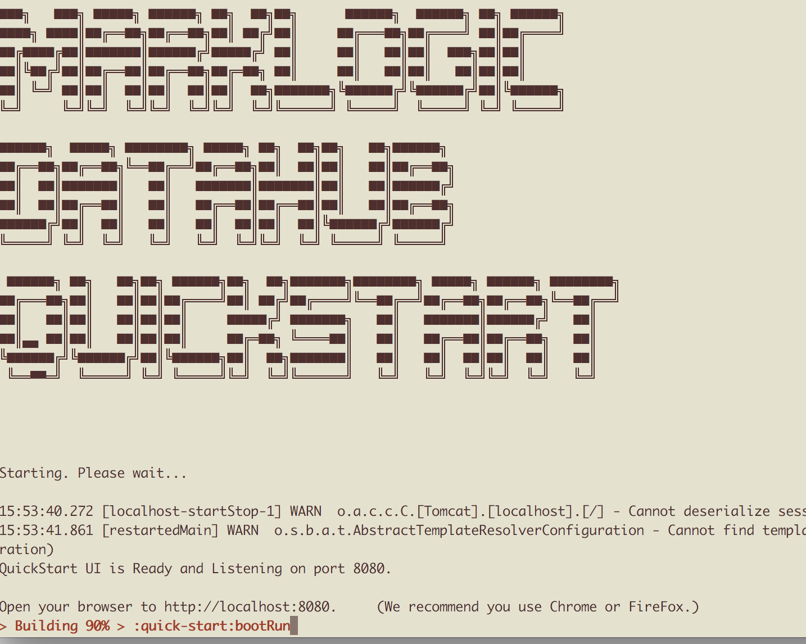
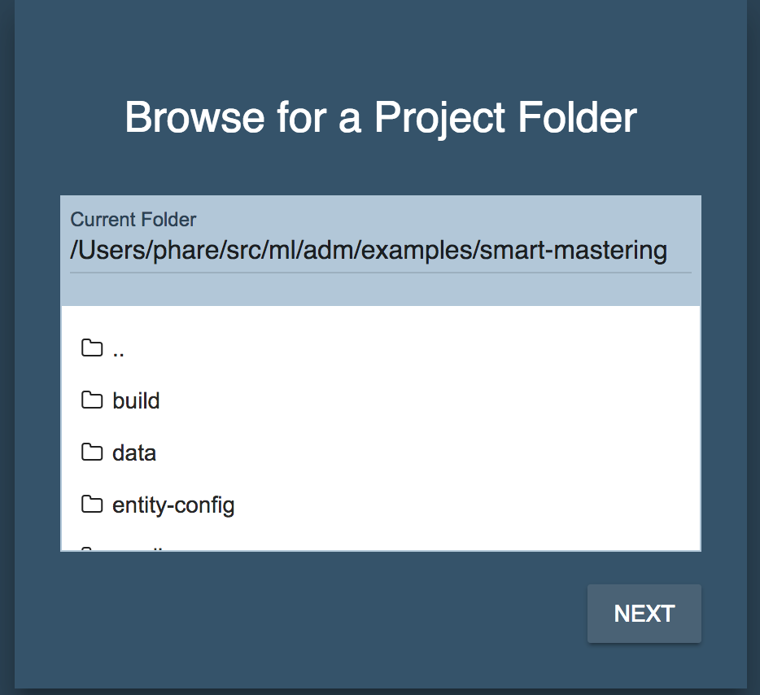
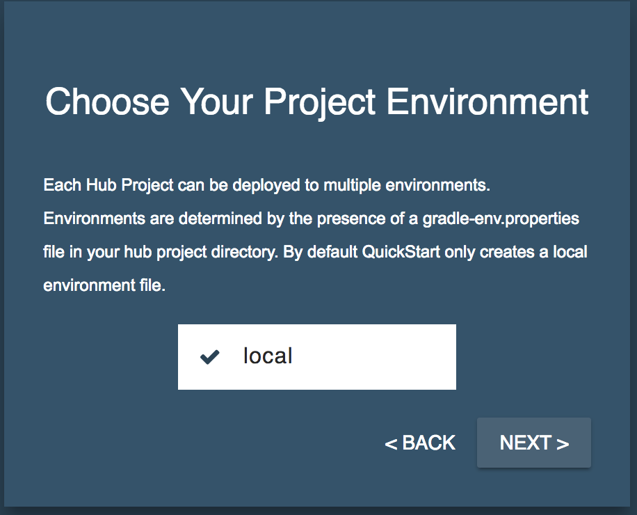
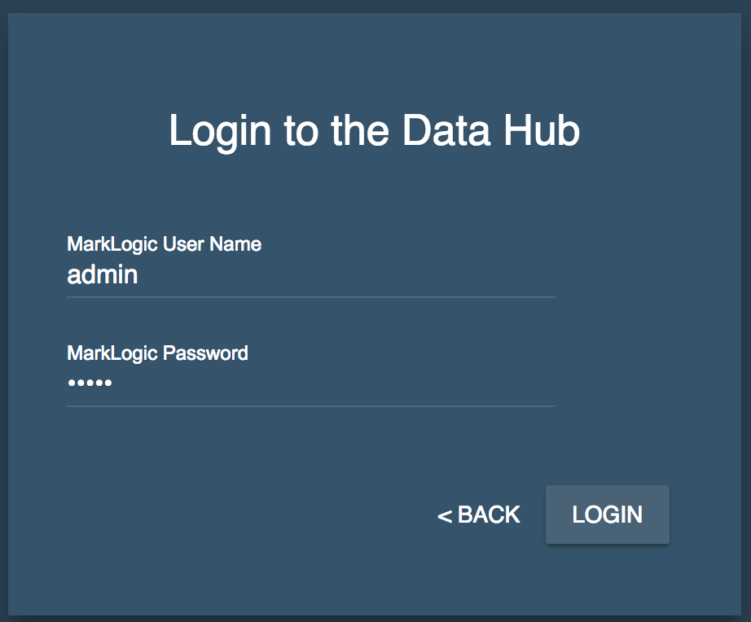

# Smart Mastering Demo

This demo was created to showcase some of the features of Smart Mastering at MarkLogic World 2018. It was for demo purposes only. If want to use Smart Mastering in your project you should go to the [main page for Smart Mastering](http://marklogic-community.github.io/smart-mastering-core)

## Steps to run the Smart Mastering Demo

- open a new terminal window in the project root
- `cd examples/smart-mastering` this folder
- `gradle build`
- `gradle mlDeploy`
- `gradle prepDemo`
- `cd ../..` (to the project root)
- `gradle bootrun`  
_**Note that this process will say it's 90% complete and stay there. This is the Spring Boot appserver and will run in the background._  
</img>

- open a new terminal window
- from your project home: `gradle runui`
- Open the QuickStart UI: open your browser to http://localhost:4200
- In the QuickStart UI, drill down the directory to examples/smart-mastering  
You might have to click on the '..' to go up first.  
</img>
- Click Next
- Choose "local"  
</img>
- Login with your ML Admin credentials  
</img>

__** When running the harmonize Flows, make sure to set batch size to 1. This is a temporary limitation.__

## Something is Wrong!

If you run into issues during the `gradle prepDemo` phase you may need to clean up some things.

- `gradle clean`
- Delete the gradle cache  
  **mac/\*nix:**  
    `rm -rf ~/.gradle/cache`  
  **windows:**  
    delete the folder `C:\Users\[Your_Username]\.gradle`  
- Delete the maven cache  
  **mac/\*nix:**  
    `rm -rf ~/.m2/repositories/com/marklogic`  
  **windows:**  
    delete the folder `C:\Documents and Settings\[Your_Username]\.m2\com\marklogic`
- Now repeat the instructions from above

